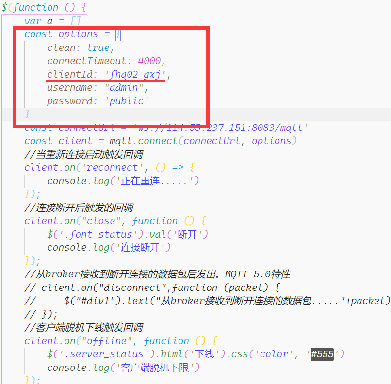

# 头部模块

连接状态：一般都会连接成功。

服务器状态：客户端和服务器端出现问题都会报错（文本为错误只能是客户端本身出错），可以看控制台排查错误。

订阅主题：默认连接主题是Water、DHT11、DO，连接成功后会显示。

数据发送：在一键浇水模块，上传合适数据后并且成功响应后便会显示上传成功，发布主题：GEN、DJ。

# 上传模块

#### 一键浇水

角度:	-90~90°

# 显示模块

#### 数据显示

浇水量、温度、湿度存在最大值，如果数据上传过大，动画显示可能会溢出。

#### 数据记录

保存最后一次浇水量、温度、湿度、光照数据，保存路径为浏览器下载路径。

#### 舵机模拟
转速：	0~360°/s

# 注意

1）Edge 浏览器长时间未响应该页面，会触发闲置功能，这是服务器状态会下线，刷新即可。

2）不同用户测试该网站时，需要设置 js 文件夹中的 function.mqtt.js 文件内的 option 对象 cilentId。

3）使用 Git 时，如果 function.mqtt.js 在暂存区，那么会占用 CilentID 报错。

4）温度动画：越红代表温度越高，越蓝表示温度越低，合适温度（15~25°C）下颜色较深

5）暂时无法更改保存路径，只能通过手动更改浏览器下载路径

6）刷新后数据会重新更新

# 开源项目

jquery:           https://github.com/jquery

mqtt.js:          https://github.com/mqttjs

FileSaver.js:   https://github.com/eligrey/FileSaver.js

